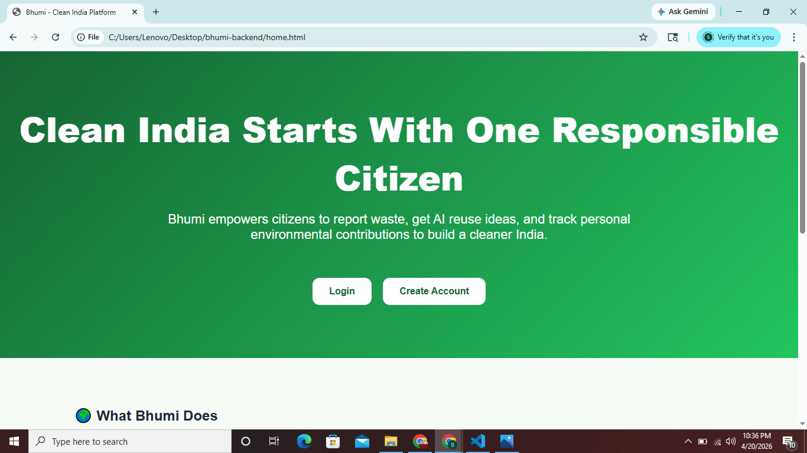
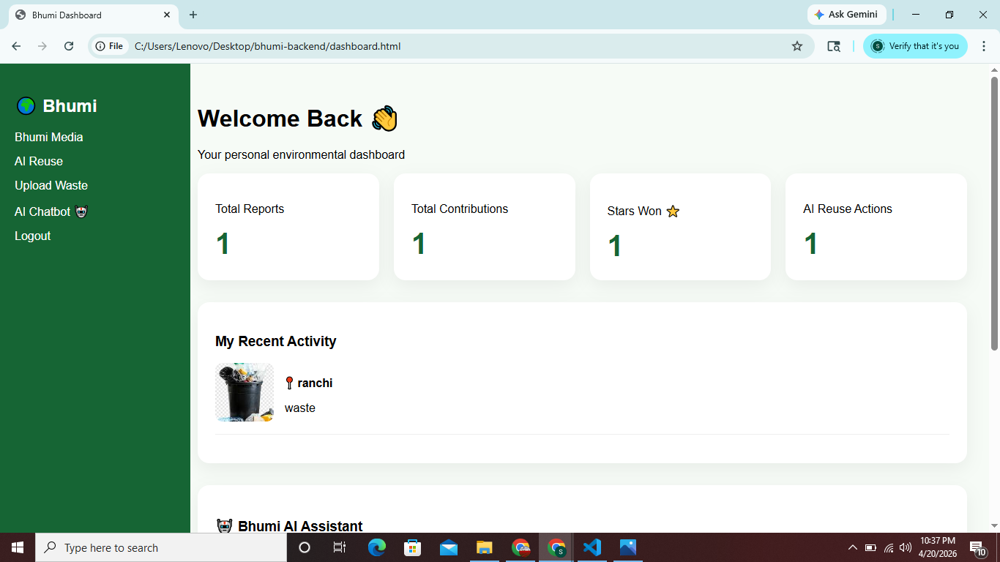
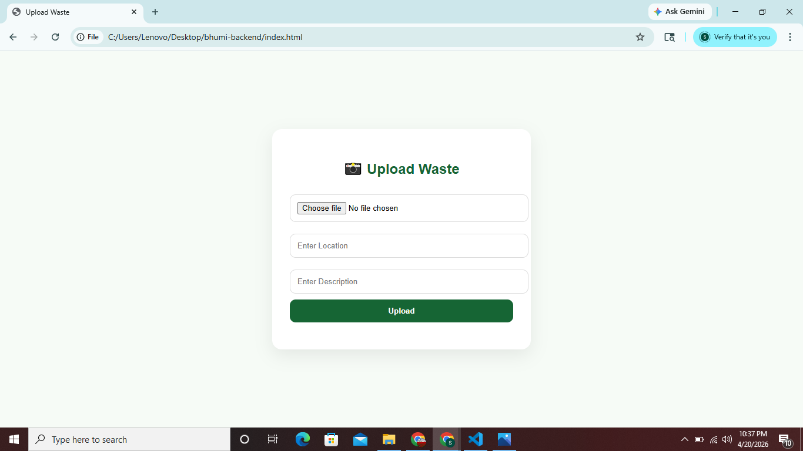
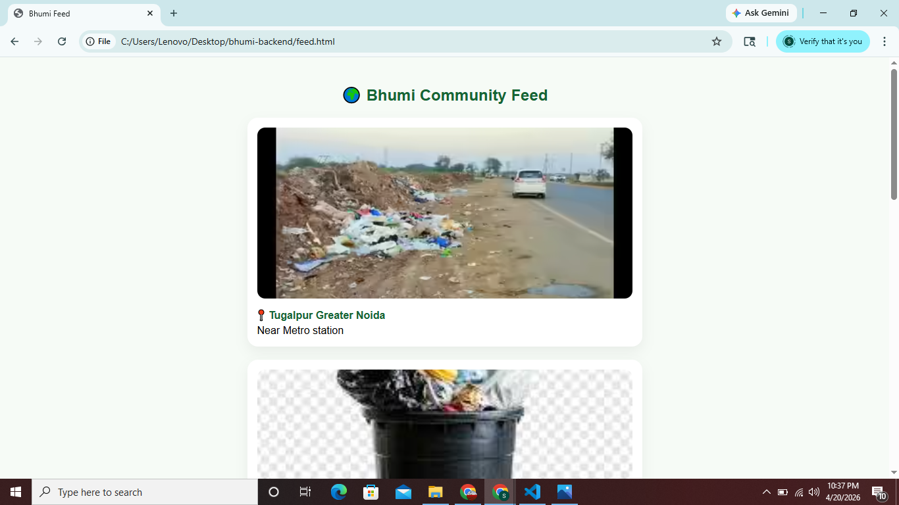
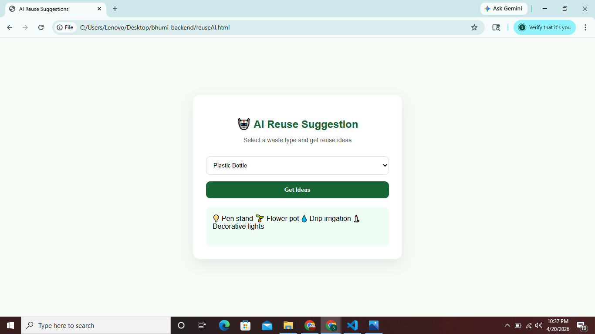
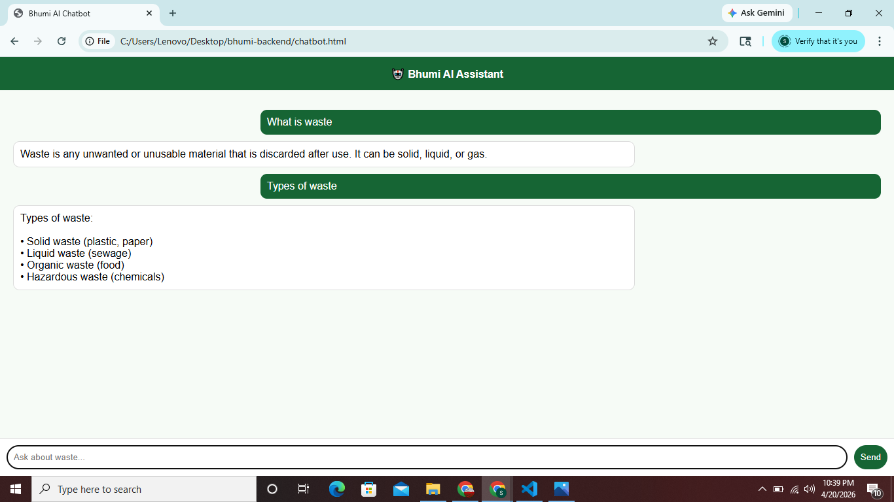
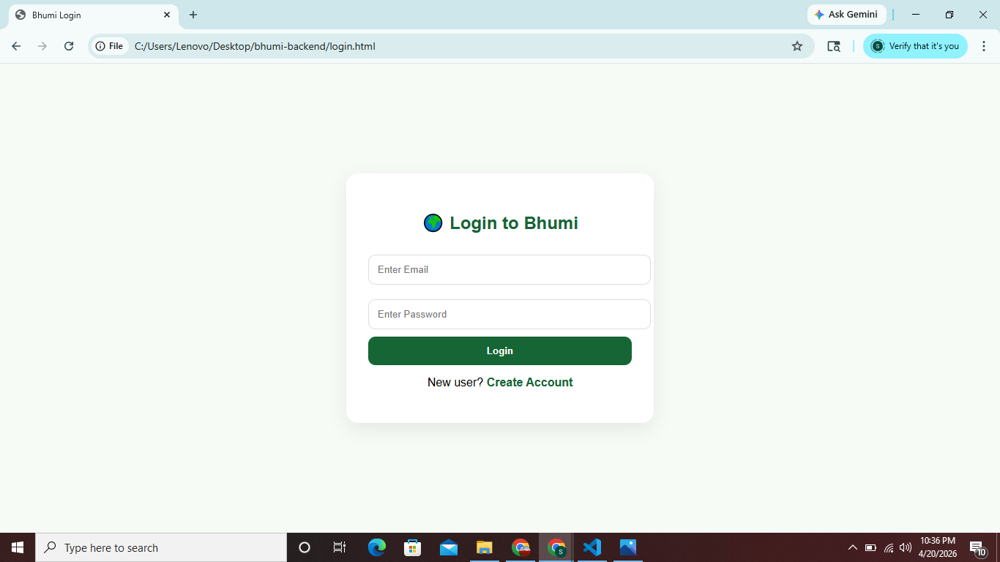

# 🌍 Bhumi – Smart Waste Management Platform

> ♻️ Report Waste | 🤖 AI Suggestions | 📊 Track Impact

Bhumi is a full-stack web application designed to promote **cleanliness, recycling, and smart waste management**.
It allows users to report waste, track their contributions, get reuse ideas, and interact with an intelligent chatbot.

---

## 🌟 Features Overview

---

### 🏠 Home Page



The home page introduces Bhumi with a clean UI and highlights all major features of the platform including waste reporting, AI reuse, and community awareness.

---

### 📊 Dashboard



The dashboard provides a personalized overview for each user:

* Total waste reports submitted
* Contributions count
* Stars earned ⭐
* Recent activity tracking

👉 Helps users track their environmental impact.

---

### 📸 Upload Waste



Users can report waste by:

* Uploading an image
* Adding location 📍
* Writing description

👉 This data is stored in MongoDB and contributes to community awareness.

---

### 🌐 Bhumi Media Feed



A social feed where users can:

* View waste reports from others
* Stay aware of environmental issues
* Learn from real-world waste problems

---

### ♻️ AI Reuse Suggestion



Provides smart reuse ideas for waste materials:

* Plastic, wood, cloth, metal, etc.
* Suggests creative and eco-friendly uses

👉 Encourages recycling and reuse.

---

### 🤖 AI Chatbot



An intelligent chatbot that:

* Answers waste management questions
* Provides academic knowledge
* Explains Indian waste laws & policies

👉 Works offline (no API required).

---

### 🔐 Login System



Secure authentication system:

* User Signup & Login
* Each user gets a personal dashboard
* Data is stored and managed securely

---

## 🧠 Tech Stack

* **Frontend:** HTML, CSS, JavaScript
* **Backend:** Node.js, Express.js
* **Database:** MongoDB Atlas
* **Tools:** Git, GitHub

---

## 📁 Project Structure

```
bhumi-backend/
│
├── models/
├── routes/
├── controllers/
├── uploads/
│
├── server.js
├── package.json
├── .gitignore
│
├── dashboard.html
├── chatbot.html
├── feed.html
├── index.html
├── login.html
├── signup.html
├── reuseAI.html
├── home.html
```

---

## ⚙️ Setup & Installation

### 1️⃣ Clone the Repository

```
git clone https://github.com/YOUR_USERNAME/YOUR_REPO_NAME.git
cd YOUR_REPO_NAME
```

---

### 2️⃣ Install Dependencies

```
npm install
```

---

### 3️⃣ Create `.env` File

Create a file named `.env` in the root folder and add:

```
MONGO_URI=your_mongodb_connection_string
```

---

### 4️⃣ Run the Server

```
npm start
```

---

### 5️⃣ Open in Browser

```
http://localhost:5000/home.html
```

---

## ⚠️ Important Notes

* Do NOT upload `.env` file (contains sensitive data)
* `node_modules` is automatically installed
* Ensure MongoDB is connected

---

## 🌍 Indian Waste Management Laws Covered

* Solid Waste Management Rules, 2016
* Plastic Waste Management Rules, 2016
* E-Waste Management Rules, 2016
* Biomedical Waste Management Rules, 2016
* Swachh Bharat Mission

---

## 🎯 Future Improvements

* 🌐 Deploy project online (Render)
* 📊 Add leaderboard system
* 🧠 Improve chatbot intelligence
* 📱 Make UI fully responsive

---

## 👨‍💻 Author

**Satyam Tiwari**
B.Tech CSE Student

---

## 🌱 Goal

To encourage people to:

* Reduce waste
* Reuse materials
* Recycle efficiently

👉 Making environment cleaner using technology 💚

---

## ⭐ Support

If you like this project:

* ⭐ Star the repo
* 🍴 Fork it
* 📢 Share it

---
